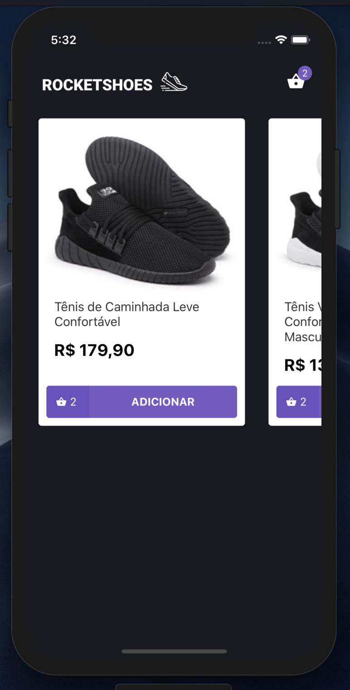
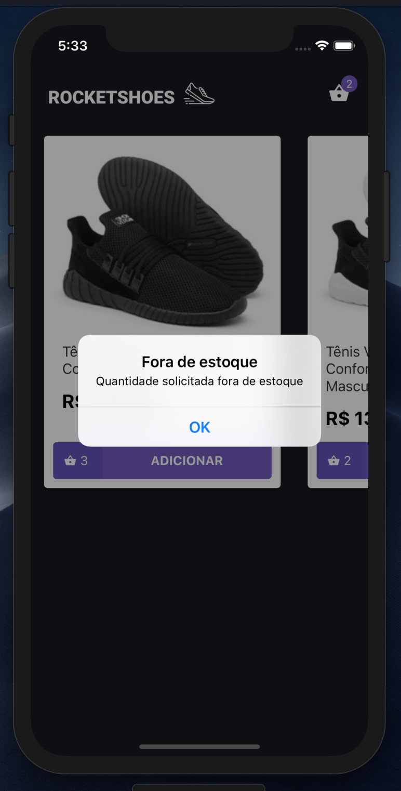
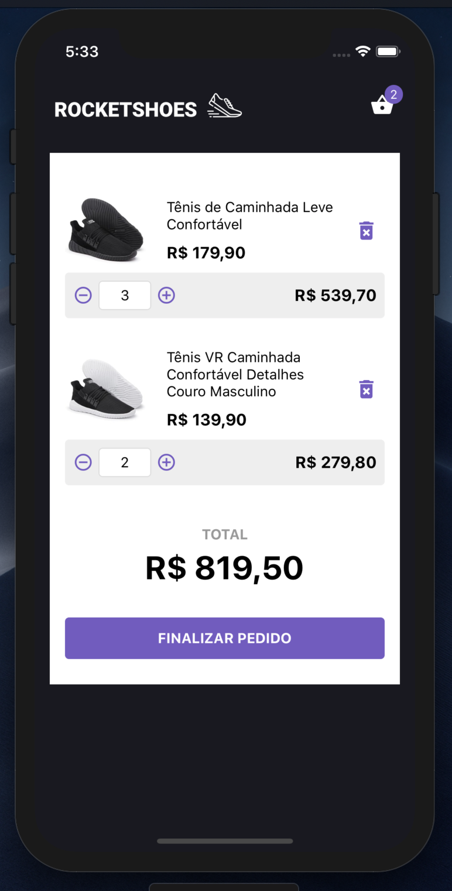

# Rocketshoes

## Bootcamp ReactNative Rocketseat

Site de vendas de tênis desenvolvido com ReactNative, redux e redux saga

<table>
  <tr>
    <td></td>
    <td></td>
    <td></td>
  </tr>
</table>

### Fake API

Inicie a fake api, com `json-server`.

Instale o `json-server` (instalação global: `yarn global add json-server` ou local `yarn add -D json-server`).

Depois execute a api que consome o arquivo `server.json` na raiz do projeto:

> json-server server.json -p 3333 -w

Depois, inicie a aplicação:

> yarn ios

ou

> yarn android
